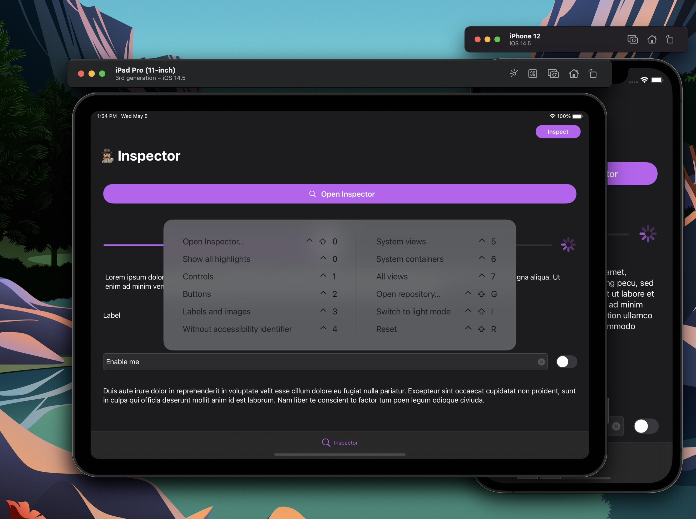

[](https://github.com/ipedro/Inspector/blob/main/LICENSE) 


# 🕵🏽‍♂️ Inspector

Inspector is a debugging library written in Swift.


## Contents
* [Why use it?](#why-use-it)
    * [Better development experience](#better-development-experience)
    * [Better QA with a reverse Zeplin](#better-qa-with-a-reverse-zeplin)
* [Requirements](#requirements)
* [Installation](#installation)
    * [Swift Package Manager](#swift-package-manager)
* [Setup](#setup)
    * [Scene Delegate](#scenedelegate.swift)
    * [App Delegate](#appdelegate.swift)
    * [Enable Key Commands *(Recommended)*](#enable-key-commands-recommended)
    * [Remove framework files from relase builds *(Optional)*](#remove-framework-files-from-relase-builds-optional)
* [Presenting the Inspector](#presenting-the-inspector)
    * [iOS Simulators and iPads](#ios-simulators-and-ipads)
        * [Key Commands](#key-commands)
    * [iPhones](#iphones)
        * [Using built-in inspectorBarButtonItem](#using-built-in-inspectorbarbuttonitem)
        * [Adding custom UI](#adding-custom-ui)
        * [With motion gestures](#with-motion-gestures)
* [Customization](#Customization)
    * [InspectorHostable Protocol](#inspectorhostable-protocol)
        * [View hierarchy layers](#var-inspectorviewhierarchylayers-inspectorviewhierarchylayer--get-)
        * [View hierarchy color scheme](#var-inspectorviewhierarchycolorscheme-inspectorviewhierarchycolorscheme--get-)
        * [Custom commands](#var-inspectorcommandgroups-inspectorcommandgroup--get-)
        * [Custom element libraries](#var-inspectorelementlibraries-inspectorelementlibraryprotocol--get-)
* [Donate](#donate)
* [Credits](#credits)
* [License](#license)

---

## Why use it?

### Better development experience

* Add your own custom commands to show in the interface and [key commands](#enable-key-commands-recommended) while developing on the simulator (also on iPad).
* Filter views by any criteria you choose: class, a property, anything.
* Inspect view hierarchy faster then using Xcode's built-in one, or
* Inspect view hierarchy without Xcode.
* Test changes and fix views live.

### Better QA with a reverse [Zeplin](https://zeplin.io)
* Inspect view hierarchy without Xcode.
* Test changes and fix views live.
* Easily validate specific state behaviors.
* Better understanding of the inner-workings of components
* More accurate feedback for developers. 

## Requirements

* iOS 11.0+
* Xcode 11+
* Swift 5.3+

---
## Installation

## Swift Package Manager

The [Swift Package Manager](https://swift.org/package-manager/) is a tool for automating the distribution of Swift code and is integrated into the swift compiler. It is in early development, but Inspector does support its use on supported platforms.

Once you have your Swift package set up, adding `Inspector` as a dependency is as easy as adding it to the dependencies value of your `Package.swift`.

```swift
// Add to Package.swift

dependencies: [
  .package(url: "https://github.com/ipedro/Inspector.git", .upToNextMajor(from: "1.0.0"))
]
```
---
## Setup

After a [successful installation](#installation), you need to add conformance to the [`InspectorHostable`](#inspectorhostable-protocol) protocol in [`SceneDelegate.swift`](#scene-delegate-example) or [`AppDelegate.swift`](#app-delegate-example) assign itself as `Inspector` host.

### SceneDelegate.swift

```swift
// Scene Delegate Example

import UIKit

#if DEBUG
import Inspector

extension SceneDelegate: InspectorHostable {}
#endif

class SceneDelegate: UIResponder, UIWindowSceneDelegate {
    var window: UIWindow?

    func scene(_ scene: UIScene, willConnectTo session: UISceneSession, options connectionOptions: UIScene.ConnectionOptions) {

        #if DEBUG
        // Make your class the Inspector' host when returning a scene
        Inspector.host = self
        #endif
        
        guard let _ = (scene as? UIWindowScene) else { return }
    }

    (...)
}
```
### AppDelegate.swift

```swift
// App Delegate Example

import UIKit
#if DEBUG
import Inspector

extension AppDelegate: InspectorHostable {}
#endif

final class AppDelegate: UIResponder, UIApplicationDelegate {
    var window: UIWindow?
    
    func application(_ application: UIApplication, didFinishLaunchingWithOptions launchOptions: [UIApplication.LaunchOptionsKey: Any]?) -> Bool {
        
        #if DEBUG
        // Make your class the Inspector's host when launching with options
        Inspector.host = self
        #endif

        return true
    }

    (...)
}
```

### Enable Key Commands *(Recommended)*

Extend the root view controller class to enable `Inspector` key commands.

```swift
// Add to your root view controller.

#if DEBUG
override var keyCommands: [UIKeyCommand]? {
    return inspectorManager?.keyCommands
}
#endif
```
    
### Remove framework files from relase builds *(Optional)* 
In your app target: 
- Add a `New Run Script Phase` as the last phase.
- Then paste the script below  to remove all `Inspector` related files from your release builds.

``` sh
# Run Script Phase that removes `Inspector` and all its dependecies from relase builds.

if [ $CONFIGURATION == "Release" ]; then
    echo "Removing Inspector and dependencies from $TARGET_BUILD_DIR/$FULL_PRODUCT_NAME/"

    find $TARGET_BUILD_DIR/$FULL_PRODUCT_NAME -name "Inspector*" | grep . | xargs rm -rf
    find $TARGET_BUILD_DIR/$FULL_PRODUCT_NAME -name "UIKeyCommandTableView*" | grep . | xargs rm -rf
    find $TARGET_BUILD_DIR/$FULL_PRODUCT_NAME -name "UIKeyboardAnimatable*" | grep . | xargs rm -rf
    find $TARGET_BUILD_DIR/$FULL_PRODUCT_NAME -name "UIKitOptions*" | grep . | xargs rm -rf
    find $TARGET_BUILD_DIR/$FULL_PRODUCT_NAME -name "ObjectAssociation*" | grep . | xargs rm -rf
fi

```
---

## Presenting the Inspector

### iOS Simulators and iPads

#### Key Commands



After [enabling Key command support](#enable-key-commands-recommended), you can:

- Invoke `Inspector` by pressing <kbd>Ctrl</kbd> + <kbd>Shift</kbd> + <kbd>0</kbd>.

- Toggle between showing/hiding view layers by pressing <kbd>Ctrl</kbd> + <kbd>Shift</kbd> + <kbd>1-8</kbd>.

- Showing/hide all layers by pressing <kbd>Ctrl</kbd> + <kbd>Shift</kbd> + <kbd>9</kbd>.

### iPhones

Unlike the [iPhone Simulator](#ios-simulators-and-ipads), physical iPhones do not support key commands, so we need something else.

All you need to present the inspector is to call `presentInspector(animated: _:)` form any view controller or window instance. And that you can achieve in all sorts of creative ways, heres some suggestions.

### Using built-in `inspectorBarButtonItem`

As a convenience, there is the `var inspectorBarButtonItem: UIBarButtonItem { get }` availabe on every `UIViewController` instance. It handles the presentation for you, and just needs to be set as a tool bar (or navigation) items, like this:
```swift
// Add to any view controller

override func viewDidLoad() {
    super.viewDidLoad()

    #if DEBUG
    navigationItem.rightBarButtonItem = self.inspectorBarButtonItem
    #endif
}
```

### Adding custom UI

After creating a custom interface on your app, such as a floating button, or any other control of your choosing, you can then simply add any view controller as a target with selector `inspectorManagerPresentation()`.

```swift 
// Add to any view controller

override func viewDidLoad() {
    super.viewDidLoad()

    #if DEBUG
    self.myCustomControl.addTarget(self, action: #selector(UIViewController.inspectorManagerPresentation), for: .touchUpInside) // or any other event
    #endif
}
```

### With motion gestures

You can also present `Inspector` using a gesture, like shaking the device. That way no UI needs to be introduced. One convienient way to do it is subclassing (or extending) `UIWindow` with the following code:

```swift
// Declare inside a subclass or UIWindow extension.

#if DEBUG
open override func motionBegan(_ motion: UIEvent.EventSubtype, with event: UIEvent?) {
    super.motionBegan(motion, with: event)

    guard motion == .motionShake else {
        return
    }

    presentInspector(animated: true)
}
#endif
```

---

## Customization

`Inspector` allows you to customize and introduce new behavior on views specific to your codebase, through the `InspectorHostable` Protocol.

## InspectorHostable Protocol
* `var window: UIWindow? { get }`
* [`var inspectorViewHierarchyLayers: [Inspector.ViewHierarchyLayer] { get }`](#var-inspectorviewhierarchylayers-inspectorviewhierarchylayer--get-)
* [`var inspectorViewHierarchyColorScheme: Inspector.ViewHierarchyColorScheme? { get }`](#var-inspectorviewhierarchycolorscheme-inspectorviewhierarchycolorscheme--get-)
* [`var inspectorCommandGroups: [Inspector.CommandGroup] { get }`](#var-inspectorcommandgroups-inspectorcommandgroup--get-)
* [`var inspectorElementLibraries: [InspectorElementLibraryProtocol] { get }`](#var-inspectorelementlibraries-inspectorelementlibraryprotocol--get-)

---

#### `var inspectorViewHierarchyLayers: [Inspector.ViewHierarchyLayer] { get }`

Default value is an empty array. `ViewHierarchyLayer` are toggleable and shown in the `Highlight views` section on the Inspector interface, and also can be triggered with <kbd>Ctrl</kbd> + <kbd>Shift</kbd> + <kbd>1 - 8</kbd>. You can use one of the default ones or create your own.

**Default View Hierarchy Layers**:

- `activityIndicators`: *Shows activity indicator views.*
- `buttons`: *Shows buttons.*
- `collectionViews`: *Shows collection views.*
- `containerViews`: *Shows all container views.*
- `controls`: *Shows all controls.*
- `images`: *Shows all image views.*
- `maps`: *Shows all map views.*
- `pickers`: *Shows all picker views.*
- `progressIndicators`: *Shows all progress indicator views.*
- `scrollViews`: *Shows all scroll views.*
- `segmentedControls`: *Shows all segmented controls.*
- `spacerViews`: *Shows all spacer views.*
- `stackViews`: *Shows all stack views.*
- `tableViewCells`: *Shows all table view cells.*
- `collectionViewReusableVies`: *Shows all collection resusable views.*
- `collectionViewCells`: *Shows all collection view cells.*
- `staticTexts`: *Shows all static texts.*
- `switches`: *Shows all switches.*
- `tables`: *Shows all table views.*
- `textFields`: *Shows all text fields.*
- `textViews`: *Shows all text views.*
- `textInputs`: *Shows all text inputs.*
- `webViews`: *Shows all web views.*

```swift
// Example

var inspectorViewHierarchyLayers: [Inspector.ViewHierarchyLayer] {
    [
        .controls,
        .buttons,
        .staticTexts + .images,
        .layer(
            name: "Without accessibility identifiers",
            filter: { element in
                guard let accessibilityIdentifier = element.accessibilityIdentifier?.trimmingCharacters(in: .whitespacesAndNewlines) else {
                    return true
                }
                return accessibilityIdentifier.isEmpty
            }
        )
    ]
}

```

---

#### `var inspectorViewHierarchyColorScheme: Inspector.ViewHierarchyColorScheme? { get }`

Return your own color scheme for the hierarchy label colors, instead of (or to extend) the default color scheme.

```swift
// Example

var inspectorViewHierarchyColorScheme: Inspector.ViewHierarchyColorScheme? {
    .colorScheme { view in
        switch view {
        case is MyView:
            return .systemPink
            
        default:
        // fallback to default color scheme
            return Inspector.ViewHierarchyColorScheme.default.color(for: view)
        }
    }
}
```
---

#### `var inspectorCommandGroups: [Inspector.CommandGroup] { get }`

Default value is an empty array. Command groups appear as sections on the main `Inspector` UI and can have key command shortcuts associated with them, you can have as many groups, with as many commands as you want.

```swift
// Example

var inspectorCommandGroups: [Inspector.CommandGroup] {
    guard let window = window else { return [] }
    
    [
        .group(
            title: "My custom commands",
            commands: [
                .command(
                    title: "Reset",
                    icon: .exampleCommandIcon,
                    keyCommand: .control(.shift(.key("r"))),
                    closure: {
                        // Instantiates a new initial view controller on a Storyboard application.
                        let storyboard = UIStoryboard(name: "Main", bundle: nil)
                        let vc = storyboard.instantiateInitialViewController()

                        // set new instance as the root view controller
                        window.rootViewController = vc
                        
                        // restart inspector
                        Insopector.restart()
                    }
                )
            ]
        )
    ]
}
```

---

#### `var inspectorElementLibraries: [InspectorElementLibraryProtocol] { get }`

Default value is an empty array. Element Libraries are entities that conform to `InspectorElementLibraryProtocol` and are each tied to a unique type. *Pro-tip: Enumerations are recommended.*

```swift 
// Example

var inspectorElementLibraries: [InspectorElementLibraryProtocol] {
    ExampleElementLibrary.allCases
}
```

```swift 
// Element Library Example

import UIKit
import Inspector

enum ExampleElementLibrary: InspectorElementLibraryProtocol, CaseIterable {
    case myClass
    
    var targetClass: AnyClass {
        switch self {
        case .myClass:
            return MyView.self
        }
    }
    
    func viewModel(for referenceView: UIView) -> InspectorElementViewModelProtocol? {
        switch self {
        case .myClass:
            return MyClassInspectableViewModel(view: referenceView)
        }
    }
    
    func icon(for referenceView: UIView) -> UIImage? {
        switch self {
        case .myClass:
            return UIImage(named: "MyClassIcon") // optional
        }
    }
}
```
```swift
// Element ViewModel Example

import UIKit
import Inspector

final class MyClassInspectableViewModel: InspectorElementViewModelProtocol {
    var title: String = "My View"
    
    let myObject: MyView
    
    init?(view: UIView) {
        guard let myObject = view as? MyView else {
            return nil
        }
        self.myObject = myObject
    }
    
    enum Properties: String, CaseIterable {
        case cornerRadius = "Round Corners"
        case backgroundColor = "Background Color"
    }
    
    var properties: [InspectorElementViewModelProperty] {
        Properties.allCases.map { property in
            switch property {
            case .cornerRadius:
                return .toggleButton(
                    title: property.rawValue,
                    isOn: { self.myObject.roundCorners }
                ) { [weak self] roundCorners in
                    guard let self = self else { return }

                    self.myObject.roundCorners = roundCorners
                }
                
            case .backgroundColor:
                return .colorPicker(
                    title: property.rawValue,
                    color: { self.myObject.backgroundColor }
                ) { [weak self] newBackgroundColor in
                    guard let self = self else { return }

                    self.myObject.backgroundColor = newBackgroundColor
                }
            }
            
        }
    }
}

```
---

## Donate
You can support development with PayPal.

[](https://www.paypal.com/donate?hosted_button_id=LJU86LQ4NUYGN) 

---

## Credits

`Inspector` is owned and maintained by [Pedro Almeida](https://pedro.am). You can follow him on Twitter at [@ipedro](https://twitter.com/ipedro) for project updates and releases.

---

## License

`Inspector` is released under the MIT license. [See LICENSE](https://github.com/ipedro/Inspector/blob/master/LICENSE) for details.

