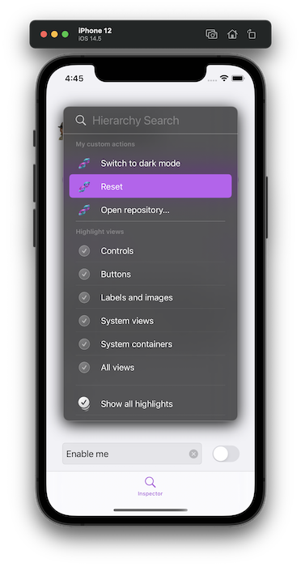

[](https://github.com/ipedro/Inspector/blob/develop/LICENSE) 


# 🕵🏽‍♂️ Inspector


Inspector is a debugging library written in Swift.

* [Requirements](#requirements)
* [Installation](#installation)
  * [Swift Package Manager](#swift-package-manager)
* [Usage](#usage)
  * [Scene Delegate Example](#scene-delegate-example)
  * [App Delegate Example](#app-delegate-example)
  * [Pro tips:](#pro-tips) 
    * [Remove framework files from relases](#remove-framework-files-from-relases)
    * [Add Custom Actions](#add-custom-actions)
* [Credits](#credits)
* [License](#license)

## Requirements

* iOS 11.0+
* Xcode 11+
* Swift 5.3+

## Installation

## Swift Package Manager

The [Swift Package Manager](https://swift.org/package-manager/) is a tool for automating the distribution of Swisft code and is integrated into the swift compiler. It is in early development, but Inspector does support its use on supported platforms.

Once you have your Swift package set up, adding `Inspector` as a dependency is as easy as adding it to the dependencies value of your `Package.swift`.

``` swift
dependencies: [
  .package(url: "https://github.com/ipedro/Inspector.git", .upToNextMajor(from: "1.0.0"))
]
```

## Usage

After a [successful installation](#installation), you need to extend your `SceneDelegate.swift` of `AppDelegate.swift` by conforming to `InspectorHostable`, and assigning your class as the `Inspector` host.

### Scene Delegate Example

``` swift
import UIKit

#if DEBUG
import Inspector

extension SceneDelegate: InspectorHostable {}
#endif

class SceneDelegate: UIResponder, UIWindowSceneDelegate {

    var window: UIWindow?

    func scene(_ scene: UIScene, willConnectTo session: UISceneSession, options connectionOptions: UIScene.ConnectionOptions) {

        #if DEBUG
        // Make your class the Inspector' host when returning a scene
        Inspector.host = self
        #endif
        
        guard let _ = (scene as? UIWindowScene) else { return }
    }

    (...)
}
```
### App Delegate Example

``` swift
import UIKit
#if DEBUG
import Inspector

extension AppDelegate: InspectorHostable {}
#endif

final class AppDelegate: UIResponder, UIApplicationDelegate {
    
    var window: UIWindow?
    
    func application(_ application: UIApplication, didFinishLaunchingWithOptions launchOptions: [UIApplication.LaunchOptionsKey: Any]?) -> Bool {
        
        #if DEBUG
        // Make your class the Inspector's host when launching with options
        Inspector.host = self
        #endif

        return true
    }

    (...)
}
```

### InspectorHostable Protocol
The protocol you need to conform to be able to be Inspector host.

``` swift
public protocol InspectorHostable: AnyObject {
    var window: UIWindow? { get }

    // Optional
    var inspectorViewHierarchyLayers: [Inspector.ViewHierarchyLayer] { get }

    // Optional
    var inspectorViewHierarchyColorScheme: Inspector.ViewHierarchyColorScheme { get }

    // Optional
    var inspectorActionGroups: [Inspector.ActionGroup] { get }

    // Optional
    var inspectorElementLibraries: [InspectorElementLibraryProtocol] { get }
}
```

* ```var inspectorViewHierarchyLayers: [Inspector.ViewHierarchyLayer] { get }```

    Default value is an empty array. `ViewHierarchyLayer` are togglabe and shown in the `Highlight views` section on the Inspector interface, and also can be triggered with <kbd>Ctrl</kbd> + <kbd>Shift</kbd> + <kbd>1 - 9</kbd>. You can create your own or use one of the default ones.

    - `activityIndicators`: Shows activity indicator views.
    - `buttons`: Shows buttons.
    - `collectionViews`: Shows collection views.
    - `containerViews`: Shows all container views.
    - `controls`: Shows all controls.
    - `images`: Shows all image views.
    - `maps`: Shows all map views.
    - `pickers`: Shows all picker views.
    - `progressIndicators`: Shows all progress indicator views.
    - `scrollViews`: Shows all scroll views.
    - `segmentedControls`: Shows all segmented controls.
    - `spacerViews`: Shows all spacer views.
    - `stackViews`: Shows all stack views.
    - `tableViewCells`: Shows all table view cells.
    - `collectionViewReusableVies`: Shows all collection resusable views.
    - `collectionViewCells`: Shows all collection view cells.
    - `staticTexts`: Shows all static texts.
    - `switches`: Shows all switches.
    - `tables`: Shows all table views.
    - `textFields`: Shows all text fields.
    - `textViews`: Shows all text views.
    - `textInputs`: Shows all text inputs.
    - `webViews`: Shows all web views.

    ``` swift
    // Example

    var inspectorViewHierarchyLayers: [Inspector.ViewHierarchyLayer] {
        [
            .controls,
            .buttons,
            .staticTexts + .images,
            .layer(
                name: "Without accessibility identifiers",
                filter: { element in
                    guard let accessibilityIdentifier = element.accessibilityIdentifier?.trimmingCharacters(in: .whitespacesAndNewlines) else {
                        return true
                    }
                    return accessibilityIdentifier.isEmpty
                }
            )
        ]
    }
    
    ```

* ```var inspectorActionGroups: [Inspector.ActionGroup] { get }```

    

    Default value is an empty array. Action groups appear as sections on the Inspector interface, you can have as many groups, with as many actions as you would like.

    ``` swift
    // Example

    var inspectorActionGroups: [Inspector.ActionGroup] {
        guard let window = window else { return [] }
        
        [
            .actionGroup(
                title: "My custom actions",
                actions: [
                    .action(
                        title: "Reset",
                        icon: .exampleActionIcon,
                        keyCommand: .control(.shift(.key("r"))),
                        closure: {
                            // Instantiate the initial view controller again on a Storyboard application.
                            let storyboard = UIStoryboard(name: "Main", bundle: nil)
                            let vc = storyboard.instantiateInitialViewController()

                            // set new instance as the root view controller
                            window.rootViewController = vc
                            
                            // restart inspector
                            Insopector.restart()
                        }
                    )
                ]
            )
        ]
    }
    ```
* ```var inspectorActionGroups: [Inspector.ActionGroup] { get }```


## Pro-tips

### Remove framework files from relases
In your app target, add a `New Run Script Phase`, and then use the following commands to remove all inspector related files from your release builds.

``` sh
# Run Script Phase that removes `Inspector` and all its dependecies from relase builds.

if [ $CONFIGURATION == "Release" ]; then
    echo "Removing Inspector and dependencies from $TARGET_BUILD_DIR/$FULL_PRODUCT_NAME/"

    find $TARGET_BUILD_DIR/$FULL_PRODUCT_NAME -name "Inspector*" | grep . | xargs rm -rf
    find $TARGET_BUILD_DIR/$FULL_PRODUCT_NAME -name "UIKeyCommandTableView*" | grep . | xargs rm -rf
    find $TARGET_BUILD_DIR/$FULL_PRODUCT_NAME -name "UIKeyboardAnimatable*" | grep . | xargs rm -rf
    find $TARGET_BUILD_DIR/$FULL_PRODUCT_NAME -name "UIKitOptions*" | grep . | xargs rm -rf
    find $TARGET_BUILD_DIR/$FULL_PRODUCT_NAME -name "ObjectAssociation*" | grep . | xargs rm -rf
fi

```

## Credits

`Inspector` is owned and maintained by [Pedro Almeida](https://pedro.am). You can follow him on Twitter at [@ipedro](https://twitter.com/ipedro) for project updates and releases.

## License

`Inspector` is released under the MIT license. [See LICENSE](https://github.com/ipedro/Inspector/blob/master/LICENSE) for details.

